# ARCHITECTURE.md — YotaLeague

> **Version:** 1.0.0 · **Last Updated:** June 2026  
> Complete system architecture reference for the YotaLeague serverless PWA tournament manager.

---

## Table of Contents

1. [System Overview](#1-system-overview)
2. [Technology Stack](#2-technology-stack)
3. [System Architecture Diagram](#3-system-architecture-diagram)
4. [Project File Structure](#4-project-file-structure)
5. [Database Schema](#5-database-schema)
6. [Authentication Flow](#6-authentication-flow)
7. [State Management](#7-state-management)
8. [Data Flow](#8-data-flow)
9. [Tournament Algorithms](#9-tournament-algorithms)
10. [AR Club Roulette Architecture](#10-ar-club-roulette-architecture)
11. [Credential Injection Flow](#11-credential-injection-flow)
12. [CI/CD Pipelines](#12-cicd-pipelines)
13. [Security Model](#13-security-model)
14. [Progressive Web App (PWA) & Offline Support](#14-progressive-web-app-pwa--offline-support)
15. [Key Design Decisions](#15-key-design-decisions)

---

## 1. System Overview

YotaLeague is a **serverless Progressive Web App (PWA)** designed to manage eFootball tournaments. There is **no traditional backend server**. All business logic runs in the browser; persistence is handled by Supabase's managed PostgreSQL instance accessed directly from the client via PostgREST.

### Core Architectural Principles

| Principle | Implementation |
|---|---|
| **Zero-backend** | No Node.js / Python / Go server. Browser talks directly to Supabase PostgREST. |
| **Serverless persistence** | All tournament state is stored as JSONB in Supabase. |
| **Anonymous-first** | No user registration. Each browser session is uniquely identified via Supabase Anonymous Auth. |
| **Offline-capable** | Service Worker intercepts GET requests; app shell is served from cache when offline. |
| **Static hosting** | Deployed to GitHub Pages as a collection of static files. |
| **Secret-safe** | Supabase credentials never committed to git. Injected at deploy-time by GitHub Actions. |

---

## 2. Technology Stack

| Layer | Technology | Version / Source |
|---|---|---|
| **Frontend UI** | Vanilla HTML5 / CSS3 / ES2022 JavaScript | (No framework) |
| **Rendering Pattern** | Single Page Application (SPA) with manual DOM manipulation | – |
| **Backend-as-a-Service** | Supabase (PostgreSQL + PostgREST + GoTrue Auth) | `@supabase/supabase-js@2` via jsDelivr CDN |
| **Database** | PostgreSQL (managed by Supabase) | – |
| **AI / Computer Vision** | face-api.js (`@vladmandic/face-api@1.7.12`) | jsDelivr CDN, loaded on-demand |
| **Screenshot / Share** | html2canvas (`1.4.1`) | cdnjs CDN |
| **Hosting** | GitHub Pages | Static, HTTPS |
| **CI/CD** | GitHub Actions | `deploy.yml`, `wake-supabase.yml` |
| **PWA** | Web App Manifest + Service Worker (`sw.js`) | Network-First caching strategy |
| **Icons** | `icon-192.png`, `icon-512.png`, `favicon.ico` | Local static assets |

---

## 3. System Architecture Diagram

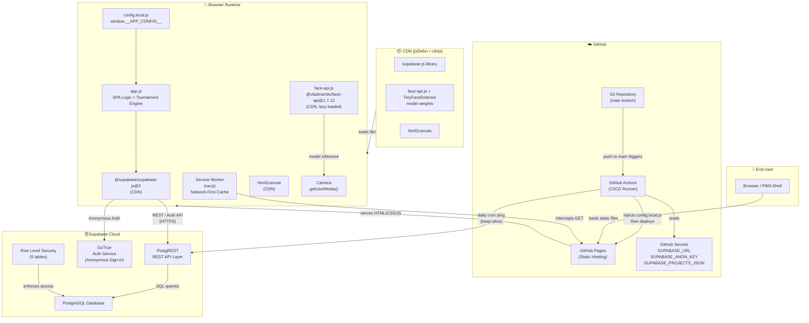

---

## 4. Project File Structure

```
YotaLeague/
├── index.html               # Single-page application shell & all UI sections
├── style.css                # All styling (dark theme, responsive, animations)
├── app.js                   # All application logic (~2,071 lines)
├── sw.js                    # Service Worker (Network-First strategy)
├── manifest.json            # PWA Web App Manifest
├── config.local.js          # ⚠️ GITIGNORED — injected by CI or created manually
├── config.local.example.js  # Template for local development credentials
├── db.sql                   # Full PostgreSQL schema + seed data + RLS policies
├── favicon.ico              # Browser tab icon
├── icon-192.png             # PWA home screen icon (192×192)
├── icon-512.png             # PWA splash screen icon (512×512)
├── .gitignore               # Excludes config.local.js and sensitive files
├── .gitattributes           # Git line-ending normalization settings
└── .github/
    └── workflows/
        ├── deploy.yml           # Deployment pipeline (push to main → GitHub Pages)
        └── wake-supabase.yml    # Daily cron to keep Supabase free-tier DB active
```

> **Note:** `config.local.js` is always listed in `.gitignore`. It is never present in the repository. In production, GitHub Actions generates it at build-time from GitHub Secrets.

---

## 5. Database Schema

All tables reside in a single Supabase PostgreSQL project. The `uuid-ossp` extension is enabled to support `uuid_generate_v4()` primary keys.

### 5.1 Schema Relationship Diagram

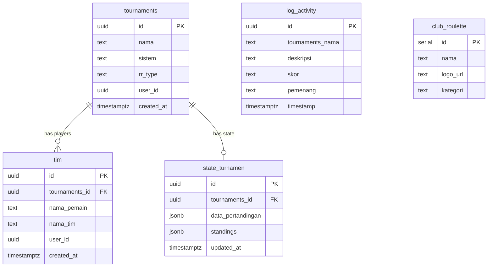

### 5.2 Table: `tournaments`

Stores top-level tournament metadata. One row per tournament session.

| Column | Type | Constraints | Description |
|---|---|---|---|
| `id` | `uuid` | `PRIMARY KEY`, default `uuid_generate_v4()` | Unique tournament identifier |
| `nama` | `text` | `NOT NULL` | Tournament display name |
| `sistem` | `text` | `NOT NULL` | Format: `'single'`, `'double'`, or `'round_robin'` |
| `rr_type` | `text` | nullable | Round Robin sub-type: `'single'` (1×) or `'double'` (2×). `NULL` for elimination formats. |
| `user_id` | `uuid` | nullable | Supabase Anonymous Auth `user.id` — links session to tournament |
| `created_at` | `timestamptz` | default `now()` | Creation timestamp |

> **Note on `user_id`:** Although the column exists for session isolation, RLS policies currently allow `public` access to all rows. The `user_id` is stored for potential future scoped queries.

### 5.3 Table: `tim`

Stores players and their associated team names. Many-to-one with `tournaments`.

| Column | Type | Constraints | Description |
|---|---|---|---|
| `id` | `uuid` | `PRIMARY KEY` | Player UUID — generated client-side via `crypto.randomUUID()` |
| `tournaments_id` | `uuid` | `FK → tournaments(id) ON DELETE CASCADE` | Parent tournament |
| `nama_pemain` | `text` | `NOT NULL` | Player's real name |
| `nama_tim` | `text` | `NOT NULL` | Team/club name the player represents |
| `user_id` | `uuid` | nullable | Session owner, mirrors the tournament's `user_id` |
| `created_at` | `timestamptz` | default `now()` | Row creation timestamp |

### 5.4 Table: `state_turnamen`

The central state store. The entire match bracket is serialized as JSONB and saved here. One row per tournament (upserted on every state change).

| Column | Type | Constraints | Description |
|---|---|---|---|
| `id` | `uuid` | `PRIMARY KEY`, default `uuid_generate_v4()` | State record ID |
| `tournaments_id` | `uuid` | `FK → tournaments(id) ON DELETE CASCADE` | Linked tournament |
| `data_pertandingan` | `jsonb` | default `'[]'` | Full matches array — bracket structure, scores, statuses, winner references |
| `standings` | `jsonb` | default `'[]'` | Round Robin standings table — per-player points, GF, GA, GD |
| `updated_at` | `timestamptz` | default `now()` | Last save timestamp |

**`data_pertandingan` JSONB structure (per match object):**

```json
{
  "id": "uuid-v4",
  "round": 1,
  "roundName": "Upper Bracket Semi Final",
  "matchIndex": 0,
  "playerA": { "id": "uuid", "nama_pemain": "Rizal", "nama_tim": "Arsenal" },
  "playerB": { "id": "uuid", "nama_pemain": "Yogi", "nama_tim": "Liverpool" },
  "scoreA": 3,
  "scoreB": 1,
  "winner": { "id": "uuid", "nama_pemain": "Rizal", "nama_tim": "Arsenal" },
  "winnerId": "uuid",
  "status": "completed",
  "isBye": false,
  "nextMatchId": "uuid-of-next-match",
  "nextSlot": "A",
  "nextLoserMatchId": "uuid-of-loser-bracket-match",
  "nextLoserSlot": "B",
  "isLoserBracket": false,
  "isGrandFinal": false
}
```

**`standings` JSONB structure (per player object):**

```json
{
  "id": "uuid",
  "nama_tim": "Arsenal",
  "nama_pemain": "Rizal",
  "played": 3,
  "won": 2,
  "drawn": 1,
  "lost": 0,
  "gf": 7,
  "ga": 2,
  "gd": 5,
  "points": 7
}
```

### 5.5 Table: `log_activity`

Append-only activity log. A new row is inserted each time a match score is saved.

| Column | Type | Constraints | Description |
|---|---|---|---|
| `id` | `uuid` | `PRIMARY KEY`, default `uuid_generate_v4()` | Log entry ID |
| `tournaments_nama` | `text` | `NOT NULL` | Denormalized tournament name (for quick display) |
| `deskripsi` | `text` | nullable | Human-readable description, e.g., `"Rizal (Arsenal) vs Yogi (Liverpool)"` |
| `skor` | `text` | nullable | Score string, e.g., `"3 - 1"` |
| `pemenang` | `text` | nullable | Winner's team name |
| `timestamp` | `timestamptz` | default `now()` | When the score was recorded |

### 5.6 Table: `club_roulette`

Static lookup table for the AR Club Roulette feature. Pre-seeded at setup time; not modified at runtime.

| Column | Type | Constraints | Description |
|---|---|---|---|
| `id` | `serial` | `PRIMARY KEY` | Auto-increment integer ID |
| `nama` | `text` | `NOT NULL` | Club or national team name |
| `logo_url` | `text` | nullable | Absolute URL to club crest/flag image (Wikipedia SVG/PNG) |
| `kategori` | `text` | `NOT NULL` | League/category filter: `'Premier League'`, `'La Liga'`, `'Serie A'`, `'Bundesliga'`, `'Ligue 1'`, `'Saudi Pro League'`, `'MLS'`, `'Nation'`, `'All'` |

**Seeded clubs by category:**

| Category | Count | Examples |
|---|---|---|
| Premier League | 10 | Arsenal, Liverpool, Man City, Chelsea, Tottenham… |
| La Liga | 5 | Real Madrid, Barcelona, Atlético Madrid… |
| Serie A | 8 | Juventus, Inter Milan, AC Milan, Napoli… |
| Bundesliga | 2 | Borussia Dortmund, Bayer Leverkusen |
| Ligue 1 | 3 | PSG, Lyon, Monaco |
| Saudi Pro League | 2 | Al Nassr, Al Hilal |
| MLS | 1 | Inter Miami CF |
| Nation | 20 | Brazil, Argentina, France, Germany, England… |

---

## 6. Authentication Flow

YotaLeague uses **Supabase Anonymous Authentication**. No user registration, email, or password is required.

### 6.1 How It Works

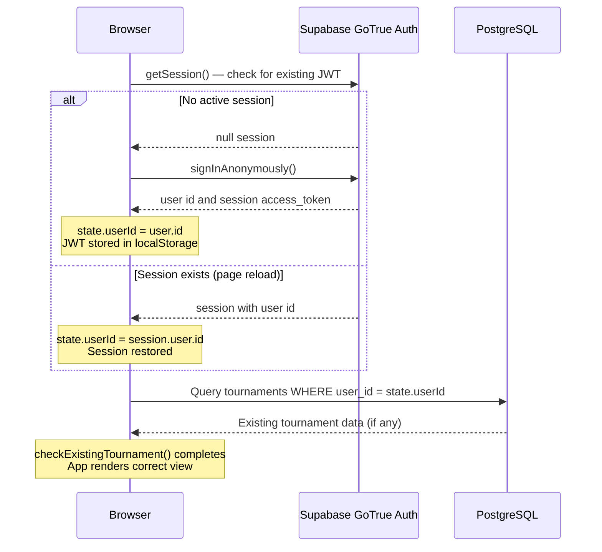

### 6.2 Session Lifecycle

| Event | Behavior |
|---|---|
| **First visit** | `signInAnonymously()` creates a new anonymous user. JWT stored in `localStorage` by the Supabase SDK. |
| **Page reload** | `getSession()` retrieves the existing JWT. Same `user_id` is restored. |
| **Clear localStorage** | Session lost. A new anonymous identity is created on next visit. |
| **Different browser / device** | A completely separate anonymous identity — tournaments are not shared. |
| **Tournament linking** | `user_id` is written to `turnamen` and `tim` rows, enabling `checkExistingTournament()` to re-hydrate state on reload. |

> **Design rationale:** Anonymous auth provides lightweight session isolation without requiring any authentication UI. Players share a single device/browser in a local LAN/party setting, making this the correct trade-off.

---

## 7. State Management

### 7.1 In-Memory State Object

The entire application state lives in a single JavaScript object declared at the top of `app.js`:

```javascript
let state = {
  userId: null,          // Supabase anonymous user UUID
  turnamenId: null,      // UUID of the active tournament row
  nama: "",              // Tournament display name
  sistem: "single",      // "single" | "double" | "round_robin"
  rrType: null,          // "single" | "double" | null
  players: [],           // Array of { id, nama_pemain, nama_tim }
  matches: [],           // Full bracket / schedule array (JSONB mirror)
  logs: [],              // Score history entries
  standings: [],         // Round Robin standings (populated for RR only)
};
```

### 7.2 State Persistence Strategy

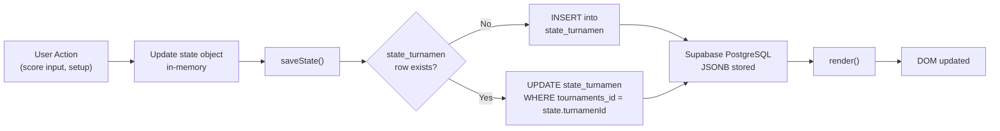

### 7.3 State Restoration on Page Load

```javascript
// On DOMContentLoaded:
1. Restore Supabase session (JWT from localStorage)
2. checkExistingTournament()
   → Query tournaments WHERE user_id = state.userId (latest by created_at)
   → If found: load teams from tim table
   → Load state_turnamen JSONB into state.matches + state.standings
3. render() → correct UI section shown
```

---

## 8. Data Flow

### 8.1 Complete Request/Response Cycle

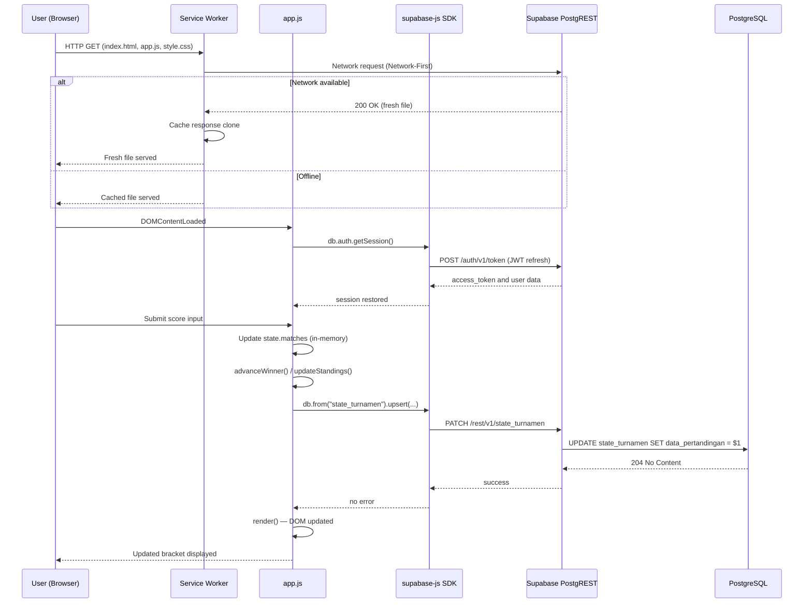

### 8.2 Tournament Creation Flow

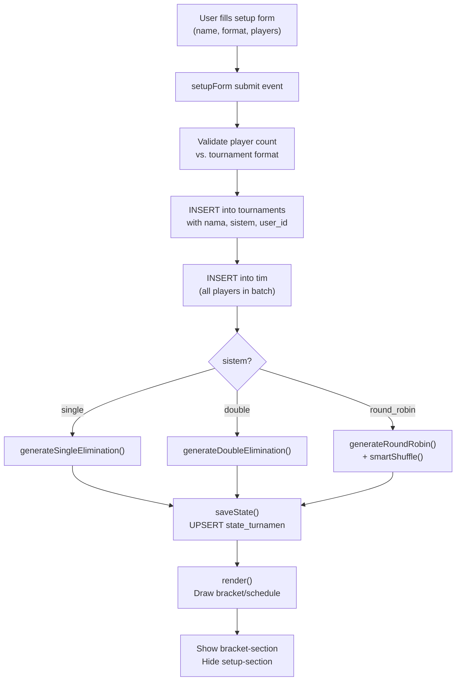

---

## 9. Tournament Algorithms

### 9.1 Single Elimination

**Supports:** Any number of players ≥ 2 (even numbers required; odd counts receive automatic BYE padding).

**Algorithm:**

1. **Shuffle:** Players are randomly shuffled via `Array.sort(() => 0.5 - Math.random())`.
2. **Power-of-2 sizing:** The next power of 2 ≥ player count is calculated. `numByes = nextPowerOf2 - numPlayers`.
3. **Round generation:** For `totalRounds = log₂(nextPowerOf2)` rounds, match slots are created per round.
4. **Linking:** Each match stores `nextMatchId` and `nextSlot` ('A' or 'B'), enabling O(1) winner propagation.
5. **BYE assignment:** BYE matches are placed at the end of Round 1, auto-completed immediately, and `advanceWinner()` is called so the real player skips to Round 2 automatically.
6. **`advanceWinner(match)`:** Recursive function that sets the winner as `playerA` or `playerB` in the next match, flipping status from `'waiting'` to `'pending'`.

```
Example: 6 players → nextPowerOf2 = 8 → 2 BYE matches

Round 1: [A vs B] [C vs D] [E vs BYE] [F vs BYE]
Round 2: [AB vs CD] [E vs F]          ← E and F auto-advance
Round 3: [GRAND FINAL]
```

### 9.2 Double Elimination

**Supports:** 4 and 8 players (hardcoded bracket structure). 2 players fall back to single elimination.

**Structure (4 players):**

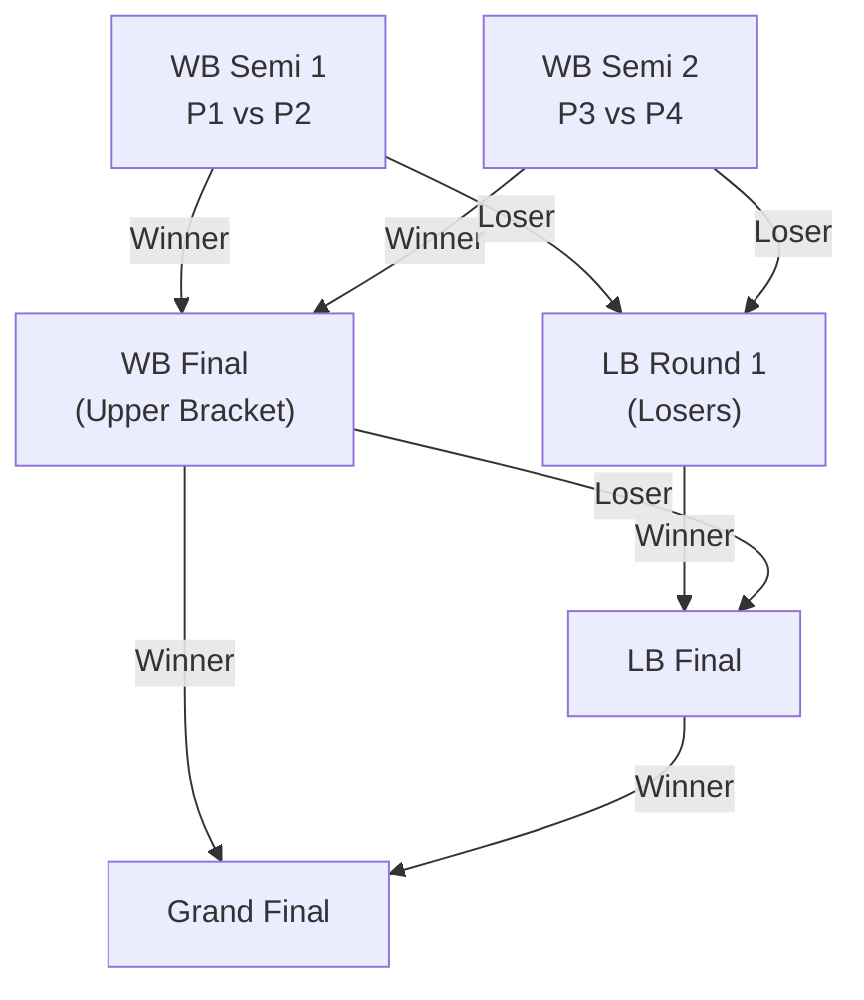

**Key properties:**
- Each match object contains both `nextMatchId` (winner path) and `nextLoserMatchId` (loser path).
- `isLoserBracket: true` flag differentiates Lower Bracket matches in rendering.
- `isGrandFinal: true` flag marks the terminal match.
- A player is eliminated only after their **second loss**.

### 9.3 Round Robin

**Supports:** Any number of players ≥ 2 (including odd numbers).

**Schedule generation using the Round-Robin algorithm:**

1. Players are arranged in a circular rotation pattern.
2. For `n` players, `n-1` rounds are generated (or `n` rounds for odd `n` with a virtual bye).
3. **`smartShuffle(matches, players)`** post-processes the schedule to prevent consecutive matches for the same player, improving fairness and pacing.
4. **Double Round Robin (`rrType = 'double'`):** The full schedule is duplicated (home/away legs), and `smartShuffle` is applied again to the combined set.
5. Matches are stored as a flat array in `state.matches`, grouped by round number.

**Standings calculation (after each match result):**

| Result | Points |
|---|---|
| **Win** | +3 |
| **Draw** | +1 |
| **Loss** | +0 |

**Tiebreaker order:** Total points → Goal Difference (GD) → Goals For (GF)

**Standings object fields:** `played`, `won`, `drawn`, `lost`, `gf` (goals for), `ga` (goals against), `gd` (goal difference), `points`.

### 9.4 `advanceWinner()` — Core Propagation Function

```javascript
function advanceWinner(completedMatch) {
  const winner = completedMatch.winner;
  const nextMatch = state.matches.find(m => m.id === completedMatch.nextMatchId);
  if (!nextMatch) return;                       // Terminal match (Grand Final)
  if (completedMatch.nextSlot === "A") {
    nextMatch.playerA = winner;
  } else {
    nextMatch.playerB = winner;
  }
  // Activate match if both slots are filled
  if (nextMatch.playerA && nextMatch.playerB) {
    nextMatch.status = "pending";
  }
  // For Double Elimination: also route loser to LB
  if (completedMatch.nextLoserMatchId) { /* ... */ }
}
```

---

## 10. AR Club Roulette Architecture

The AR Club Roulette is an optional feature that uses real-time face detection to assign football clubs to detected players in a "gacha" mechanic.

### 10.1 AR Roulette Pipeline

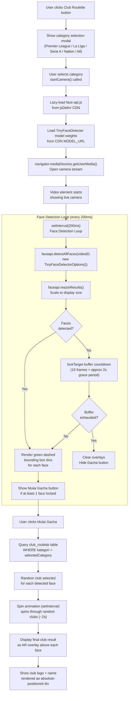

### 10.2 Technical Implementation Details

| Component | Detail |
|---|---|
| **face-api.js loading** | Lazy-loaded via dynamic `<script>` injection only when the user opens the Roulette modal. Not loaded on initial page load. |
| **Model** | `TinyFaceDetector` — lightweight model optimized for real-time performance (~190KB). |
| **Model weights URL** | `https://cdn.jsdelivr.net/npm/@vladmandic/face-api@1.7.12/model` |
| **Detection interval** | `setInterval` at **200ms** (5 FPS detection rate). |
| **Lock buffer** | A `lockTargetBuffer` counter (10 frames ≈ 2 seconds) prevents the UI from flickering when a face briefly leaves frame. |
| **Bounding boxes** | Rendered as `<div>` elements with `position: absolute`, `border: 2px dashed green`, layered above the `<video>` element in an overlay container. |
| **Camera API** | `navigator.mediaDevices.getUserMedia({ video: true })` — permission granted by user per browser session. |
| **Gacha source** | `db.from("club_roulette").select("*").eq("kategori", selectedCategory)` — fetches club list from Supabase at gacha time. |
| **Club assignment** | One random club drawn per detected face. Result is deterministic per spin (not re-randomized after shown). |
| **Cleanup** | `stopCamera()` clears `faceDetectionInterval`, stops all `MediaStreamTrack`s, and resets overlay DOM. Called when the camera modal is closed. |

### 10.3 AR Overlay Visual Layout

```
┌──────────────────────────────┐
│                              │
│   ┌ ─ ─ ─ ─ ─ ─ ─ ─ ─ ─ ─ ┐  │
│   │  (green dashed border)  │  │
│   │                         │  │
│   │     [face area]         │  │
│   │                         │  │
│   └ ─ ─ ─ ─ ─ ─ ─ ─ ─ ─ ─ ┘  │
│   ┌─────────────────────┐    │
│   │  Arsenal FC         │    │  ← AR overlay div (above face)
│   └─────────────────────┘    │
│     <video> (live camera)    │
└──────────────────────────────┘
```

---

## 11. Credential Injection Flow

Supabase credentials (`SUPABASE_URL` and `SUPABASE_ANON_KEY`) are **never stored in the repository**. They are injected at build time for production deployments, or provided manually for local development.

### 11.1 Flow Diagram

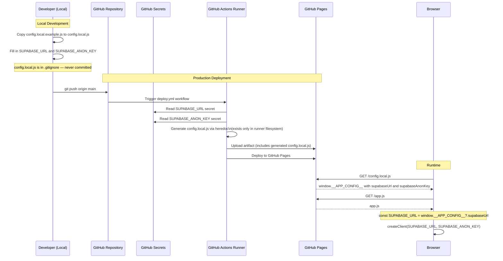

### 11.2 `config.local.js` Template

```javascript
// Generated by GitHub Actions at deploy time (NOT committed to git)
// For local dev: copy config.local.example.js to config.local.js
window.__APP_CONFIG__ = {
  supabaseUrl: "https://XXXXXXXXXXXX.supabase.co",
  supabaseAnonKey: "eyJ..."
};
```

### 11.3 `app.js` Credential Reading

```javascript
// Reads from the injected global — graceful fallback with empty strings
const SUPABASE_URL      = window.__APP_CONFIG__?.supabaseUrl      || "";
const SUPABASE_ANON_KEY = window.__APP_CONFIG__?.supabaseAnonKey  || "";

if (!SUPABASE_URL || !SUPABASE_ANON_KEY) {
  console.error("Config not found. Ensure config.local.js exists for local dev.");
}

const db = createClient(SUPABASE_URL, SUPABASE_ANON_KEY);
```

---

## 12. CI/CD Pipelines

Two GitHub Actions workflows manage the entire delivery pipeline.

### 12.1 `deploy.yml` — Production Deployment

**Trigger:** Push to `main` branch, or manual `workflow_dispatch`.

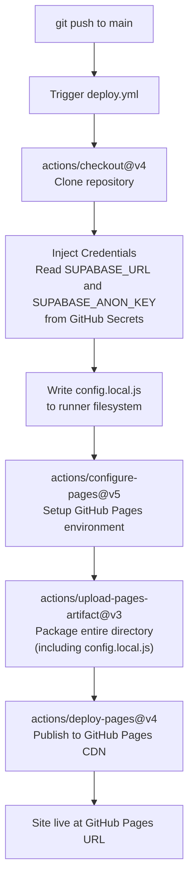

**Permissions required:**

| Permission | Value | Reason |
|---|---|---|
| `contents` | `read` | Checkout repository |
| `pages` | `write` | Deploy to GitHub Pages |
| `id-token` | `write` | OIDC-based authentication for Pages deployment |

**Concurrency configuration:** `group: "pages"`, `cancel-in-progress: false` — ensures that a running deployment is never interrupted by a new push; the second run queues instead.

### 12.2 `wake-supabase.yml` — Database Keep-Alive

**Problem:** Supabase free-tier projects are automatically paused after **7 days of inactivity**.

**Solution:** A daily cron job queries the database to reset the inactivity timer.

**Trigger:** `cron: "0 6 * * *"` (06:00 UTC = 13:00 WIB), or manual `workflow_dispatch`.

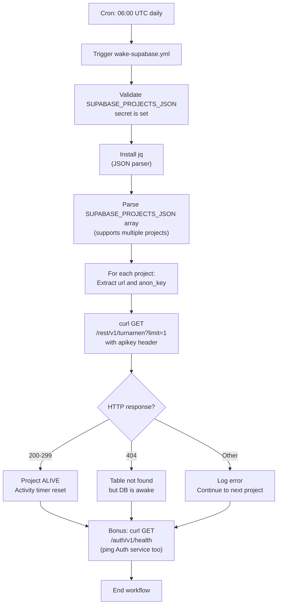

**`SUPABASE_PROJECTS_JSON` secret format:**

```json
[
  {
    "url": "https://XXXXXXXXXXXX.supabase.co",
    "anon_key": "eyJ..."
  }
]
```

> **Multi-project support:** The array format allows a single keep-alive workflow to maintain multiple Supabase projects simultaneously.

---

## 13. Security Model

### 13.1 Row Level Security (RLS)

All 5 database tables have RLS enabled. The current policy grants **public read/write access** to all rows using the anonymous key. This is a deliberate design choice for a client-side-only application with no sensitive personal data.

```sql
-- Applied to: tournaments, tim, state_turnamen, log_activity, club_roulette
ALTER TABLE <table_name> ENABLE ROW LEVEL SECURITY;
CREATE POLICY "Public Access" ON <table_name>
  FOR ALL USING (true) WITH CHECK (true);
```

### 13.2 Security Boundaries

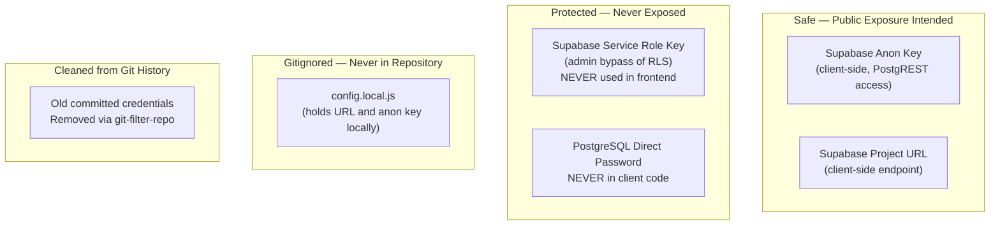

### 13.3 Security Characteristics Summary

| Concern | Status | Mechanism |
|---|---|---|
| **Credential exposure in git** | ✅ Mitigated | `config.local.js` in `.gitignore`; old secrets removed via `git-filter-repo` |
| **Unauthorized data access** | ⚠️ Accepted risk | RLS policy is `public` — consistent with no-auth serverless design |
| **Service Role key exposure** | ✅ Never exposed | Only used server-side in CI (keep-alive); never in frontend |
| **Cross-session data isolation** | ⚠️ Partial | `user_id` stored per row but not enforced by RLS policy |
| **HTTPS** | ✅ Enforced | GitHub Pages + Supabase enforce HTTPS on all endpoints |
| **CDN integrity** | ⚠️ No SRI | External CDN scripts loaded without Subresource Integrity hashes |

> **Note on the public RLS policy:** In a local/party gaming context, all participants share a device or local network. There is no sensitive personal data beyond player names. The accepted trade-off enables a zero-backend architecture.

---

## 14. Progressive Web App (PWA) & Offline Support

### 14.1 PWA Manifest (`manifest.json`)

| Field | Value |
|---|---|
| `name` | `"Yota League"` |
| `short_name` | `"Yota League"` |
| `start_url` | `"./index.html"` |
| `display` | `"standalone"` (no browser chrome) |
| `theme_color` | `"#14b8a6"` (teal) |
| `background_color` | `"#090f1f"` (dark navy) |
| `icons` | 192×192 and 512×512 PNG (`any maskable` purpose) |

### 14.2 Service Worker Strategy (`sw.js`)

The Service Worker implements a **Network-First** strategy:

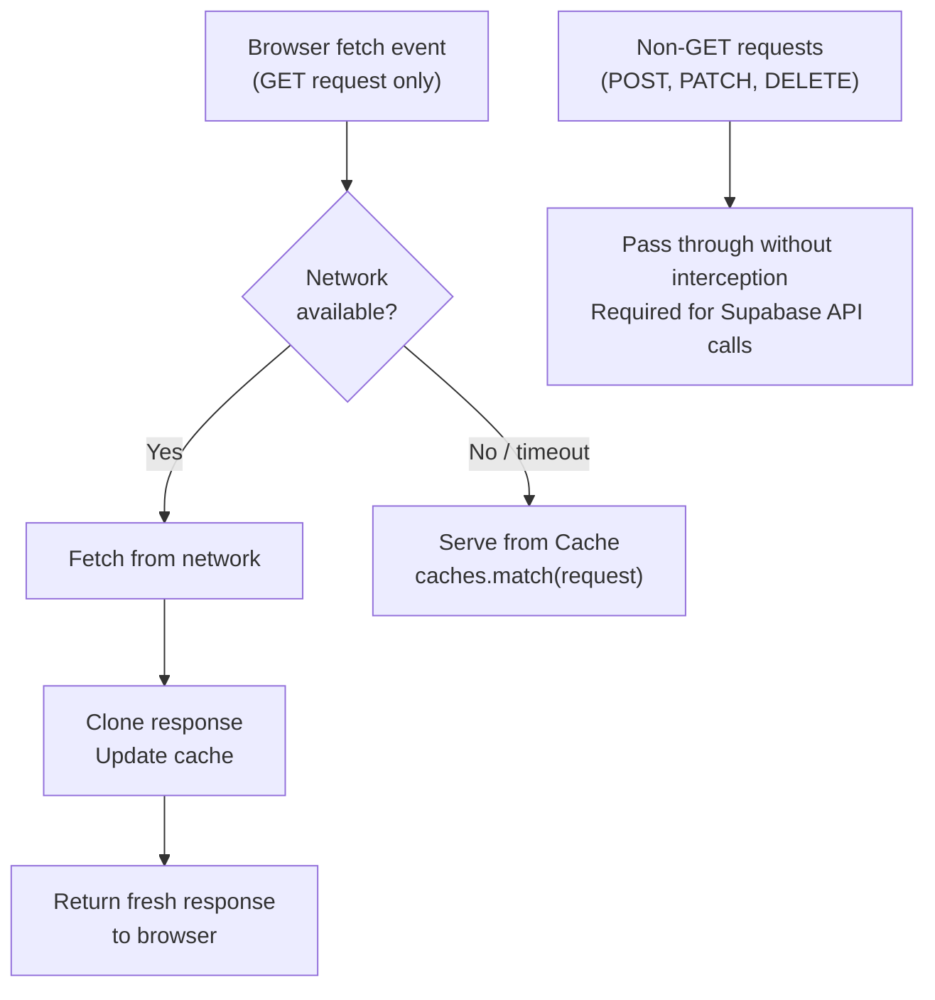

**Cache name:** `yota-league-v3`

**Pre-cached on install:**

```
./              (root)
./index.html
./style.css
./app.js
./manifest.json
./icon-192.png
./icon-512.png
```

**Cache lifecycle:**
- `install` event: calls `self.skipWaiting()` (immediate activation) and pre-caches all assets.
- `activate` event: deletes all caches that do not match `CACHE_NAME` (removes old versions on update).
- `fetch` event: intercepts GET requests only. POST/PATCH/DELETE bypass the worker entirely, ensuring Supabase API mutations always reach the network.

> **Important:** The `onerror` handler on the `<script src="config.local.js">` tag in `index.html` prevents a missing config file from breaking the page load — it logs a console warning instead.

---

## 15. Key Design Decisions

| Decision | Rationale |
|---|---|
| **Vanilla JS over a framework** | No build step required. The application is simple enough that React/Vue overhead is unwarranted. Deployable as-is to GitHub Pages. |
| **Supabase over Firebase** | PostgreSQL with PostgREST provides a full relational model, `uuid_generate_v4()`, JSONB columns, and typed schemas. The free tier is generous enough for a local gaming app. |
| **JSONB for match state** | The bracket structure is deeply nested and format-dependent. A normalized relational schema would require 5+ join tables. JSONB allows the full state to be saved and restored in a single query. |
| **Anonymous Auth** | Tournament participants share a local device. There is no need for personal accounts. Anonymous sessions provide just enough isolation to prevent different browsers/devices from corrupting each other's state. |
| **face-api.js TinyFaceDetector** | The lightest model in the face-api.js suite. Suitable for real-time detection at 5 FPS on mobile hardware without a GPU. Larger models (SSD MobileNet) are too slow for this use case. |
| **Lazy-loading face-api.js** | The library and its model weights (~1–2MB total) are only needed for the Roulette feature. Loading them on-demand avoids penalizing the initial page load for all other use cases. |
| **Network-First SW strategy** | Guarantees users always see the latest app version when online, while preserving functionality during offline/flaky network conditions common in local gaming venues. |
| **GitHub Actions keep-alive** | The Supabase free tier pauses after 7 days of inactivity. A simple daily `curl` is cheaper and more reliable than upgrading to a paid plan for an infrequently used app. |
| **`git-filter-repo` for history cleanup** | Credentials mistakenly committed must be fully purged from git history. `git-filter-repo` is the officially recommended tool, superior to `BFG Repo Cleaner` for this purpose. |
| **html2canvas for match sharing** | Allows generating a shareable match result graphic entirely in the browser without a server-side rendering service (e.g., Puppeteer). |

---

*This document was generated from the YotaLeague codebase as of June 2026. For schema changes, refer to [`db.sql`](./db.sql). For workflow specifics, refer to [`.github/workflows/`](./.github/workflows/).*
